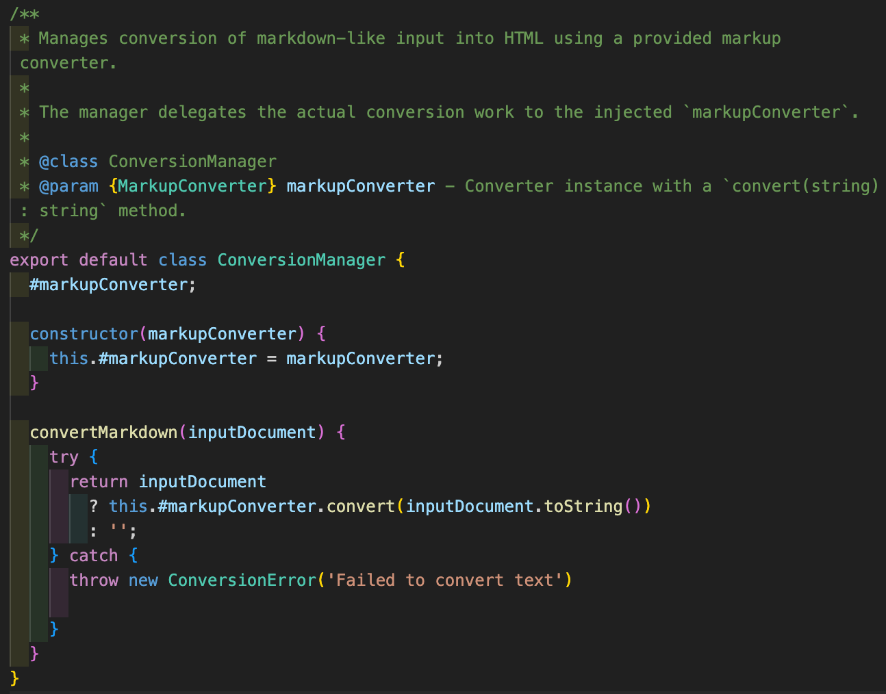
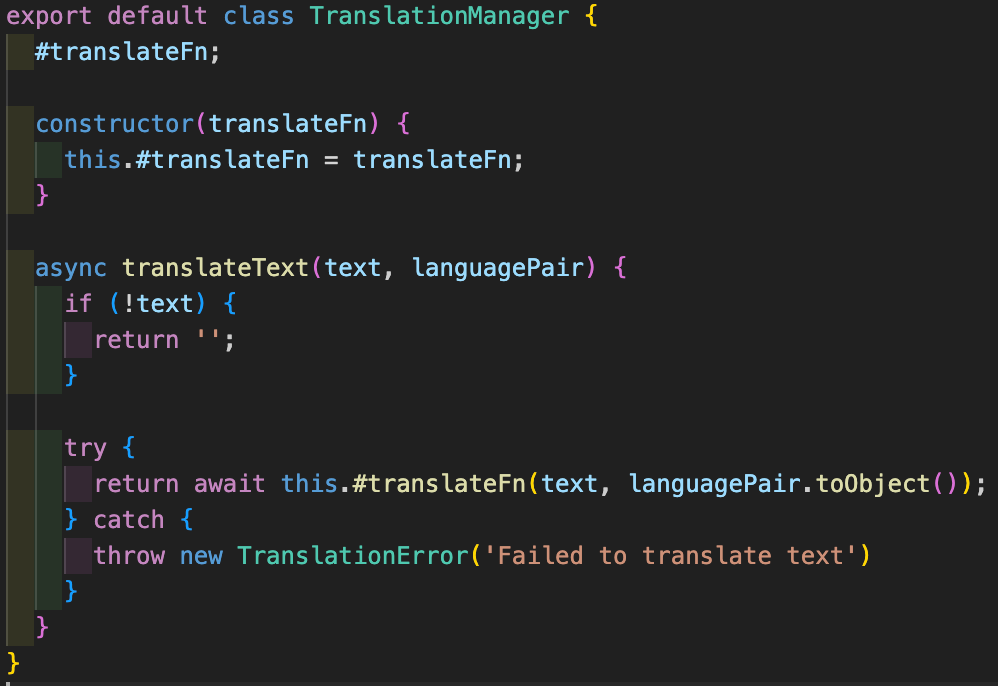
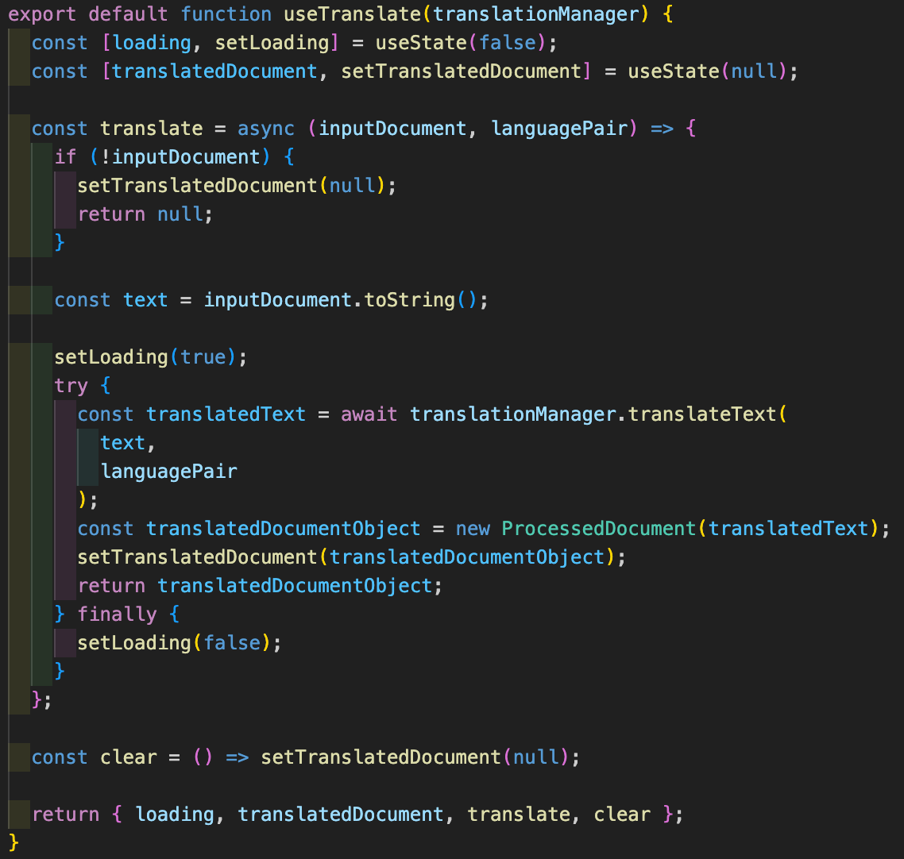

# Reflektion över kodkvalitet (Clean Code kap. 2–11)

## Kapitel 2 - Meningsfulla namn

Att använda meningsfulla namn är nog en av de viktigare principerna då mycket tid kan sparas när man inte behöver gissa vad variabeln `x` står för i just den här kontexten och istället kan läsa t.ex `translatedDocument` och direkt förstå vad som där gömmer sig.

Att komma på vettiga namn är ofta svårt, men med de refaktoreringsverktyg som IDE:er har inbyggda som automatiskt kan uppdatera ett variabelnamn på alla ställen det förekommer är det heller inga problem att justera i efterhand när man kommit på ett bättre.

## Kapitel 3 - Funktioner

Eftersom jag gillar läsbarheten man får av att bryta ner stora funktioner i mindre (`Small!`) har jag gjort det i den omfattning som känns rimlig. Jag har försökt hålla abstraktionsnivån jämn i en funktion enligt, och abstraherat bort detaljer i sina egna små hjälpfunktioner som gör en specifik sak (`Do one thing!`).

För uppdateringen av L2 modulen valde jag att göra detta för metoden nedan som konverterar inline styles som fetstilad och kursiv text.

Refaktoreringen resulterade i att mängden kod ökade men jag tycker ändå att den högre abstraktionsnivån i metoden tillsammans med de beskrivande namnen (`Use descriptive names!`) gör det värt det. Det är enklare att förstå vad som faktiskt händer. Det hade ytterligare kunnat förbättras genom att bryta ut `htmlTagMap` till en egen fil för konstanter. 

Ett exempel på bättre tydlighet är att ett "magic number", -1, som `String.includes()` metoden returnerar när delsträngen inte kan hittas abstraherats bort genom min `#hasNoClosingTag`-metod.

Något jag inte gillar med detta är att så som metoderna skrivits kräver flera av dem 3-4 parametrar vilket inte är att rekommendera och jag hade egentligen velat lägga mer tid på att hitta en väg runt detta och komma ner till maximalt 1-2 parametrar som boken föreskriver. Kanske hade `htmlTag` kunnat vara en klass? Nu finns inte tiden och jag får nöja mig med att konstatera att jag nog mest bytte vilken regel jag bryter mot här..

### Före:

### Efter:

## Kapitel 4 - Kommentarer

I modulen som är tänkt att användas av andra utvecklare och integreras med deras kod valde jag att enbart skriva `JSDOC` för de publika metoder de förväntas använda för att underlätta implementation. Tanken är inte att en modulanvändare ska (behöva) gräva djupare än så i källkoden.

I L3 har valt att skapa en JSDOC för varje React-komponent eftersom de snarare är att se som funktioner än "vanliga" HTML-element. De har props (indata) och innehåller i vissa fall villkorsstyrd rendering definierad i JSX, och där jag anser det nödvändigt har jag förklarat vad komponenten kräver. Detta för att ytterligare underlätta det modulära tänket att komponenten skulle kunna användas i andra projekt, och man då vill veta vilka props den behöver.

Jag tycker boken tar en ganska negativ inställning till kommentarer, men jag håller med om att OM man skriver en kommentar måste den tillföra något, och att detta något kanske hade kunnat förklaras med exempelvis beskrivande namn istället.

## Kapitel 5 - Formatering

Formatering är viktig, men jag tycker inte det är jätteviktigt **vilken** formatering som används! Två eller fyra mellanrums indrag och liknande upplever jag för mig inte gör någon stor skillnad, så länge det är konsekvent genom alla filer i ett projekt.

Detta tillämpas bäst genom att en automatisk formaterare används med inställningar man kommit överens om i projektet. I mitt fall valde jag att använda `Prettier` med standardinställningar vilket känns som en bra basnivå.

## Kapitel 6 - Objekt och datastrukturer

Istället för att skicka runt strängar eller liknande enkla datatyper har jag i flera fall valt att skapa objekt av klasser som används som parametrar och returobjekt.

Några exempel där jag gjort detta är LanguagePair som skapas i `LanguagePicker` när användaren väljer språk att översätta mellan. Översättningsfunktionen förväntar sig strängar med landskoder (`'sv', 'en'`) i ett objekt på formen {from: 'sv', to: 'en'} och genom att klassen fått en `toObject()`-metod som returnerar landskoderna i rätt format minskar risken för fel indata här. `LanguagePair`s validering i constructorn ser till att felaktiga objekt inte kan skapas.

Texten som matas in i `TextFieldInput` sparas och hanteras vidare som ett objekt av klassen `MarkdownDocument`, och efter översättning eller konvertering skapas ett `ProcessedDocument`.
I min implementation är det dock ännu inget mer än en glorifierad sträng eftersom de bara har det privata fältet `textContent` och en `toString()`-metod, men man skulle kunna tänka sig att de i framtiden kan få fler operationer och metadata.

Jag tycker detta tänk har gjort koden tydligare och lättare att felsöka eftersom jag enkelt kan skilja på olika typer i applikationen - allt är inte bara strängar! Hittar jag i debuggern ett objekt av en viss klass och vet var det skapas och vilken "väg" det borde gå genom programmet vet jag också var fel möjligen kan ha uppstått.

## Kapitel 7 - Felhantering

Jag har skapat två egna felklasser som jag kastar om översättningen eller konverteringen misslyckas.
Detta är två ställen i min kod där ett fel kan inträffa som är utom den här applikationens kontroll och jag vill därför att det genast blir tydligt vad som hänt genom ett "specialfel". Detta blir `Provide context with Exceptions` som direkt pekar felsökaren rätt.

Jag har tyvärr inte riktigt hunnit hantera felen hela "vägen upp" överallt, men nästa steg hade varit att hantera felen snyggt och informera användaren via gränsnsittet om vad som hänt. Exempelvis skulle ett `TranslationError` kunna leda till en uppmaning att användaren provar igen om en stund (API't ligger nere).

Ett ställe jag infört liknande är vid kopiering av resultatet där kopieringen via webbläsarens API kanske inte är tillgänglig (krav på webbläsarversion och säker kontext) där jag ger direkt feedback genom knappens text.

## Kapitel 8 - Gränser

Ett exempel där jag tycker jag tillämpar `Using code that does not yet exist` är i `ConversionManager` där jag genom `Dependency Injection` förser klassen med en modul som tillhandahåller en `convert(text)`-metod.

Denna klass hade utan problem kunnat utvecklas före modulen så länge detta kontrakt/interface är förutbestämt.

## Kapitel 9 - Testbarhet
Genom den objektorienterade approachen blir koden lättare att testa med automatiska enhetstester (som jag dock inte använt här..) eftersom klasserna kan testas var för sig och indata kan mockas. 

I modulen L2 byggde jag ett testbatteri med sådana enhetstester och ett par större integrationstester som testar hela kedjan vilket underlättade enormt vid refaktorisering då jag inte behövde oroa mig för att jag förstört något utan att märka det.

Flera av testerna blev tyvärr onödigt stora, med långa markdowntester som matas in. Nu i efterhand hade jag definitivt kunnat korta ned flera av dem utan att egentligen testa mindre funktionalitet. Det hade gjort dem både lättare att underhålla och att läsa. Ett kort citat från boken att luta mig moy: 

*"What makes a clean test? Three things. Readability, readability, and readability.."*

Onödigt långt exempel nedan..

## Kapitel 10 - Klasser

`Classes should be small!`

Jag tycker mina klasser både i L2 och L3 är tillräckligt små och de är väl sammanhållna där metoderna har specifika uppgifter enbart relaterade till sina egna fält.

Exemplet `LanguagePair` igen;
Klassen har som uppgift att hålla reda på och validera ett språkpar som behövs av översättningsmodulen och kunna, via sin `toObject()`-metod, returnera det i rätt datastruktur/format.

Inga onödiga fält eller metoder, och klassen har inte fler ansvar än vad som absolut krävs.

## Kapitel 11 - Systemdesign (komponenter och beroenden)

Jag har använt mig av `Dependency Injection` för de klasser som hanterar översättning och konvertering, detta för att inte skapa onödiga beroenden och möjliggöra att enkelt byta ut t.ex vilken översättare som används.

Jag har implementerat detta genom att klasserna behöver en översättningsfunktion respektive en konverteringsfunktion för att kunna initieras.

`translateFn` nedan är exempelvis funktionen som ges av npm-paketet `translate` som använder Googles API.

Min L2 modul gjorde jag enkelt utbyggbar genom dess klasshierarki där alla converters ärver de publika metoder de krävs för att fungera i applikationen från en `AbstractConverter`. För att lägga till en ny converter behöver man bara ärva från den och implementera dess kontrakt för att det ska fungera.

## Konflikter och överväganden

Jag valde att använda React för att jag gärna vill lära mig det, men jag insåg inte riktigt att det "tvingar" en att skriva kod på ett visst sätt. En komponent i React är en funktion som returnerar HTML, och det vedertagna sättet att exempelvis visa olika element baserat på state är genom villkorssatser i JSX, där ett exempel från min kod är `{mode === 'translate' && <LanguagePicker onSelect={onLanguageSelect} />}`. Denna sats (som säger att en `<LanguagePicker>` komponent med indata i form av callback-funktionen `onLanguageSelect` ska renderas om appen är i translate-läget) känns inte supertydlig, men jag antar att man vänjer sig om man jobbar mycket i React.

Att skriva objektorienterat går emot "React-tänket" men eftersom jag gillar tydligheten och separationen som klasser ger är min kod något av en hybrid där jag försökt göra separationen att applikationens logik till stor del hanteras objektorienterat och React fått stå för presentation/UI.

Hooks används enligt min tolkning som ett sätt att ge funktionella komponenter några av fördelarna som klasser har i form av att de kan inkapsla state och ha en livscykelslogik. Jag har i mitt project skapat två egna hooks för att hantera konvertering och översättning, och i dessa sker förändringen `MarkdownDocument --> ProcessedDocument`, men i övrigt har jag lagt logiken i klasser.

### useTranslate

